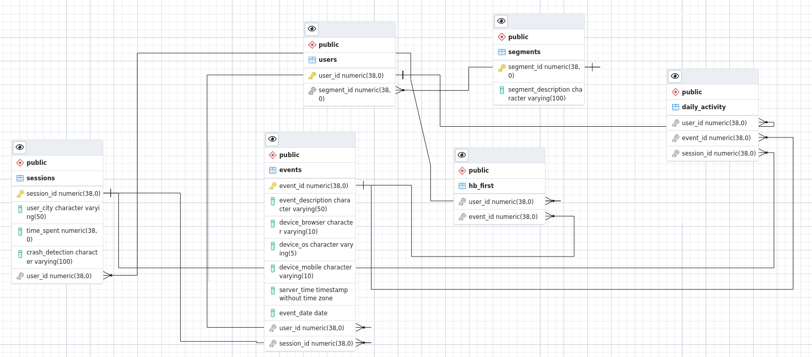

## Exercise 2

### Pregunta 1
**P:** Como resolvería este tipo de petición? Explique detalladamente el proceso de limpieza y transformación del modelo inicial. Que tecnologías utilizaría y por que?  

**R:** Comenzaria por normalizar la tabla inicial. A esta tabla la llame `initial_table` y a partir de ella cree las siguientes tablas:  

- `events`
- `segments`
- `sessions` 
- `users`

Para la creacion de estas tablas utilice `CTAS` _(Create Table As Select)_ seleccionando, de `initial_table` y con la clausula `DISTINCT`, las columnas que deseo en cada tabla.

Una vez creadas las tablas anteriores, cree las tablas requeridas por el area de Banca Privada: `hb_first` y `daily_activity`. Para el caso de la tabla `hb_first` asumi que el primer log in al Home Banking corresponde al `event_id = 1` (esto se vera en la clausula `WHERE`  de la DDL de creacion de esta tabla).   

Dado que la tabla inicial es una tabla en BigQuery, la tecnologia que utilizaria es BigQuery. Aprovecharia dos capacidades de BigQuery, que permitirian optimizar un Data Warehouse de este tamaño, y que son las clauslas `PARTITIONED BY` y `CLUSTERED BY` en las DDL de creacion, sobre todo de la tabla `daily_activity`.

### Ejercicio 1   
**P:** Realice el DER que de soporte al modelo dimensional solicitado por la banca privada.

**R:**  

  

### Ejercicio 2  
**P:** Escriba las queries necesarias partiendo de la tabla inicial y que de como resultado el modelo planteado en el ejercicio anterior.

**R:** Ver [aqui](sql_ddl/exercise_2_ddl.sql)

### Ejercicio 3  
**P:** Escriba la consulta necesaria para obtener el KPI de retención de clientes para los 10 clientes que mas veces se hayan logueado en el último mes.

### Pregunta 2  
**P:** Suponga que la ingesta de estos datos se realiza utilizando Apache Spark debido a que la tabla cruda tiene billones de registros. Que parametros de spark tendría en cuenta a la hora de realizar dicha ingesta? Explique brevemente en que consta cada uno de ellos. 
En que formato de compresión escribiría los resultados? Por que?

**R:** Por un lado, tendria en cuenta la cantidad y capacidad del cluster en cuanto a su _master node_ y _executor nodes_ y a partir de esta informacion configuraria algunas propiedades, si fuera necesario. Por ej: `spark.executor.memory`, entre otras listadas [aqui](https://spark.apache.org/docs/latest/configuration.html)

Escribiria los resultados en formato Apache Parquet. Este es un formato columnar que permite diferentes esquemas de compresion y encoding. 

El formato Parquet almacena informacion sobre la estructura (por ej, el tipo de variable de cada columna) e internamente estructura los datos en _chunks_, permitiendo leer/escribir eficientemente sin necesidad de procesar el archivo entero. Esta estructura permite otra de sus prestaciones, llamada _predicate pushdown_, que consiste en ordenar las tareas para realizar el menor trabajo posible. Por ej, filtrar las filas/columnas antes de procesarlas. 

(Ninguna de estas prestaciones esta disponible en otro formato como el csv, por eso **no** lo utilizaria)

Finalmente, Parquet es open source y agnostico en cuanto a plataforma y lenguajes de programacion. 

### Pregunta 3

Existen varios problemas en cuanto a la calidad de datos de la tablas que consultan los usuarios de la banca privada, se esta investigando como mejorar y prevenir estos incidentes. Describa brevemente que implementaría para garantizar la confiabilidad de los datos.

Para ello realizaria unit tests de calidad de datos, por ejemplo usando la libreria Great Expectations.  
Con las _Expectations_ disponibles se puede, por ejemplo, definir que columnas son mandatorias, definir el porcentaje de nulos que estamos dispuestos a aceptar, entre muchas otras.  

### Bonus Track!!!
* En qué requerimiento implementarías una cola de mensajes en una solución orientada a datos? Que lenguaje utilizarías y porque?
* Que experiencia posees sobre py spark o spark scala? Contar breves experiencias, en caso de contar experiencia con otro framework de procesamiento distribuido, dar detalles también.
* Qué funcionalidad podrías expandir desde el area de ingeniería de datos con una API y arquitectónicamente como lo modelarías?

En un proyecto de migracion de un Data Warehouse, utilice Apache Spark en un pipeline que leia tablas de Hive, realizaba transformaciones y guardaba los cambios en otra tabla de Hive, creada especialmente con algunas propiedades. 

Las transformaciones eran simples, pero la dificultad del requerimiento radicaba en escribir la informacion procesada en DynamoDB. Una opcion fue crear un archivo json iterando por cada fila del data frame e insertando el json en DynamoDB. Pero esta no fue una solucion optima ya que tardaba mucho tiempo en procesar (la tabla de origen en Hive tenia ~11 milliones de registros). 

La solucion fue utilizar Spark SQL y escribir a otra tabla de Hive que a su vez estaba "linkeada" a una tabla de DynamoDB (mas detalles [aqui](https://docs.aws.amazon.com/emr/latest/ReleaseGuide/EMR_Hive_Commands.html)).  